# 📚 Tutorial: Predict the Customer Churn

**Scenario:** You have (or download) the **Telco Customer Churn** dataset: one row per customer, with features like contract type, tenure, charges, and a **Churn** column (Yes/No). The goal is to train a model that predicts **Churn**, so you can identify at-risk customers and use the best model from the leaderboard for retention or deployment.

This tutorial walks you through that end-to-end: create a project, create S3 connections for results and training data, create a workbench with those connections attached during setup (so you do not need to restart later), add the AutoML pipeline and dataset, run AutoML with the right settings, and view the leaderboard to pick the best model.

## Table of contents

- [🏗️ Create a new project](#create-a-new-project)
- [💾 Create the S3 connections](#create-the-s3-connections)
- [⚙️ Configure the Pipeline Server](#configure-the-pipeline-server)
- [🔗 Create workbench with connections attached](#create-workbench-with-connections-attached)
- [⬆️ Upload the training dataset to S3](#upload-the-training-dataset-to-s3)
- [📋 Add the AutoML pipeline as a Pipeline Definition](#add-the-automl-pipeline-as-a-pipeline-definition)
- [▶️ Run AutoML with the required inputs](#run-automl-with-the-required-inputs)
- [📊 View the leaderboard](#view-the-leaderboard)
- [📓 Predictor Notebook](#predictor-notebook)
- [📚 Model Registry](#model-registry)
- [⚙️ Prepare the ServingRuntime for AutoGluon with KServe](#prepare-the-servingruntime-for-autogluon-with-kserve)
- [🚀 Model Deployment](#model-deployment)
- [🎯 Deployment Scoring](#deployment-scoring)

<a id="create-a-new-project"></a>

## 🏗️ Create a new project

| Step | Action |
|------|--------|
| **①** | Log in to Red Hat OpenShift AI. |
| **②** | From the OpenShift AI dashboard, go to **Projects** and create a new project (for example, `customer-churn-ml`). |

<a id="create-the-s3-connections"></a>

## 💾 Create the S3 connections

Create two S3-compatible connections in your project: one for pipeline **results** (artifacts, leaderboard) and one for **training data**. You will use the results connection when you [configure the Pipeline Server](#configure-the-pipeline-server) in the next section.

**Results storage connection**

| Step | Action |
|------|--------|
| **①** | In your project, open the **Connections** tab and click **Create connection**. |
| **②** | Select **S3 compatible object storage - v1** as the connection type. |
| **③** | Enter a unique **Connection name** (for example, `automl-results-s3`). A resource name is generated automatically. |
| **④** | Fill in the connection details: **Endpoint** (S3-compatible bucket endpoint), **Bucket** (for pipeline results and Pipeline Server artifacts), **Region**, **Access key**, **Secret key**. |
| **⑤** | Click **Create**. |

Use this connection when configuring the Pipeline Server (e.g., in **Pipeline runtimes** or project settings), so the server stores pipeline runs and artifacts in this bucket. For exact UI steps and endpoint formatting, see [Using connections](https://docs.redhat.com/en/documentation/red_hat_openshift_ai_self-managed/3.2/html/working_on_projects/using-connections_projects) and [Creating an S3 client](https://docs.redhat.com/en/documentation/red_hat_openshift_ai_self-managed/3.2/html/working_with_data_in_an_s3-compatible_object_store/creating-an-s3-client_s3) in the Red Hat OpenShift AI documentation.

**Training data connection**

| Step | Action |
|------|--------|
| **①** | In the same project, go to **Connections** and click **Create connection**. |
| **②** | Select **S3 compatible object storage - v1**. |
| **③** | Enter a unique **Connection name** (for example, `customer-churn-data-s3`) and complete **Endpoint**, **Bucket**, **Region**, **Access key**, **Secret key** for the bucket you will use for training data. |
| **④** | Click **Create**. Note the **Connection name**; you will use it as `train_data_secret_name` when creating the pipeline run. |

<a id="configure-the-pipeline-server"></a>

## ⚙️ Configure the Pipeline Server

Configure the **Pipeline Server** for your project so that pipeline runs and artifacts (e.g. leaderboard, trained models) are stored in your **results** S3 bucket. In Red Hat OpenShift AI, you do this from the project via the UI.

| Step | Action |
|------|--------|
| **①** | From the OpenShift AI dashboard, go to **Data science projects** and click the name of your project (e.g. `customer-churn-ml`). |
| **②** | Open the **Pipelines** tab (or the project details page where pipeline configuration is available). Click **Configure pipeline server**. |
| **③** | In the **Configure pipeline server** dialog, in the **Object storage connection** section, enter the same S3-compatible storage details as your **results** connection: **Bucket** (name of the bucket for pipeline artifacts), **Region**, **Endpoint**, **Access key**, and **Secret key**. Use the same values you used when creating the results S3 connection in [Create the S3 connections](#create-the-s3-connections). If the UI offers **Select existing connection**, you can choose your results S3 connection instead of re-entering the fields. |
| **④** | In the **Database** section, choose **Default database on the cluster** for development or testing, or **External MySQL database** if you have an external MySQL/MariaDB for production. |
| **⑤** | Click **Create** (or **Save**) to create or update the pipeline server. Wait until the Pipeline Server is ready. |

**Note:** For more details, see [Working with data science pipelines](https://docs.redhat.com/en/documentation/red_hat_openshift_ai_self-managed/3.2/html/working_with_ai_pipelines/working_with_ai_pipelines) in the Red Hat OpenShift AI documentation.

<a id="create-workbench-with-connections-attached"></a>

## 🔗 Create workbench with connections attached

| Step | Action |
|------|--------|
| **①** | In the project, go to **Workbenches** and create a **Workbench** (notebook environment). Choose an image and resource size as needed. |
| **②** | During workbench setup, use **Attach existing connections** to attach both the **results** S3 connection and the **training data** S3 connection you created above, so the workbench can access the buckets (e.g. to download leaderboard or artifacts later) without a restart. |
| **③** | Save and launch the workbench. For full steps, see [Creating a project and workbench](https://docs.redhat.com/en/documentation/red_hat_openshift_ai_self-managed/3.2/html/getting_started_with_red_hat_openshift_ai_self-managed/creating-a-workbench-select-ide_get-started) in the Red Hat OpenShift AI documentation. |

**Step ① — Choose workbench image and size:**

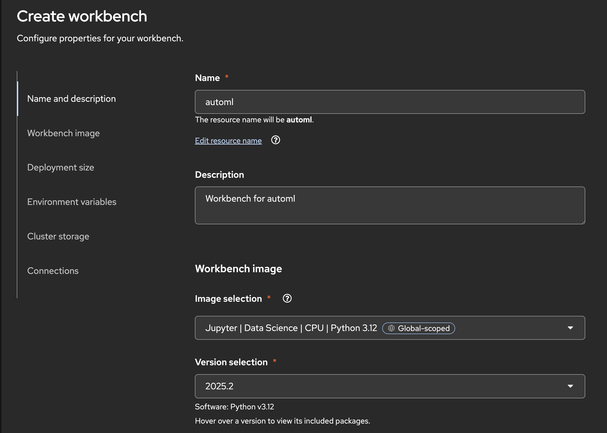

**Step ② — Attach existing connections:**

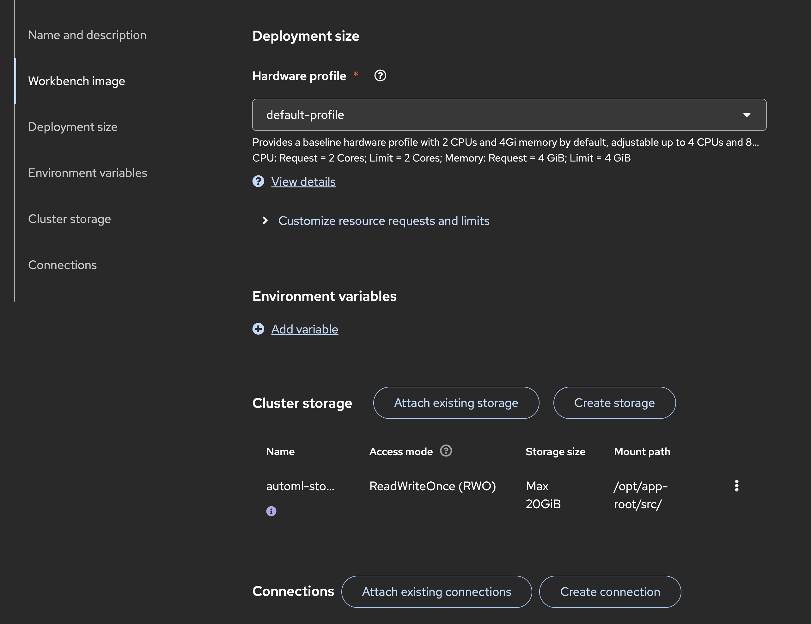

<a id="upload-the-training-dataset-to-s3"></a>

## ⬆️ Upload the training dataset to S3

| Step | Action |
|------|--------|
| **①** | Download the Customer Churn dataset: [WA_FnUseC_TelcoCustomerChurn.csv](data/WA_FnUseC_TelcoCustomerChurn.csv) (in the `data` folder in this repository). |
| **②** | Upload the file to the S3 bucket configured in the **training data** connection. Place it in a path you will use as the object key (for example, `data/WA_FnUseC_TelcoCustomerChurn.csv` or just `WA_FnUseC_TelcoCustomerChurn.csv`). |
| **③** | Note the **bucket name** and the **object key** (path) of the file; you will need them for `train_data_bucket_name` and `train_data_file_key` in the pipeline run. |

<a id="add-the-automl-pipeline-as-a-pipeline-definition"></a>

## 📋 Add the AutoML pipeline as a Pipeline Definition

| Step | Action |
|------|--------|
| **①** | Get the compiled AutoML pipeline from the repository: [autogluon_tabular_training_pipeline](https://github.com/LukaszCmielowski/pipelines-components/tree/rhoai_automl/pipelines/training/automl/autogluon_tabular_training_pipeline) (branch `rhoai_automl`). Build or download the compiled pipeline (e.g., [pipeline.yaml](https://github.com/LukaszCmielowski/pipelines-components/tree/rhoai_automl/pipelines/training/automl/autogluon_tabular_training_pipeline/pipeline.yaml)). |
| **②** | In Red Hat OpenShift AI, go to **Pipelines** (or **Develop & Train** → **Pipelines**) for your project. |
| **③** | Upload the compiled pipeline as a new **Pipeline Definition** (or create a pipeline from the YAML), following [Managing AI pipelines](https://docs.redhat.com/en/documentation/red_hat_openshift_ai_self-managed/3.2/html/working_with_ai_pipelines/managing-ai-pipelines_ai-pipelines). |

**Step ③ — Upload the compiled pipeline as a new Pipeline Definition**

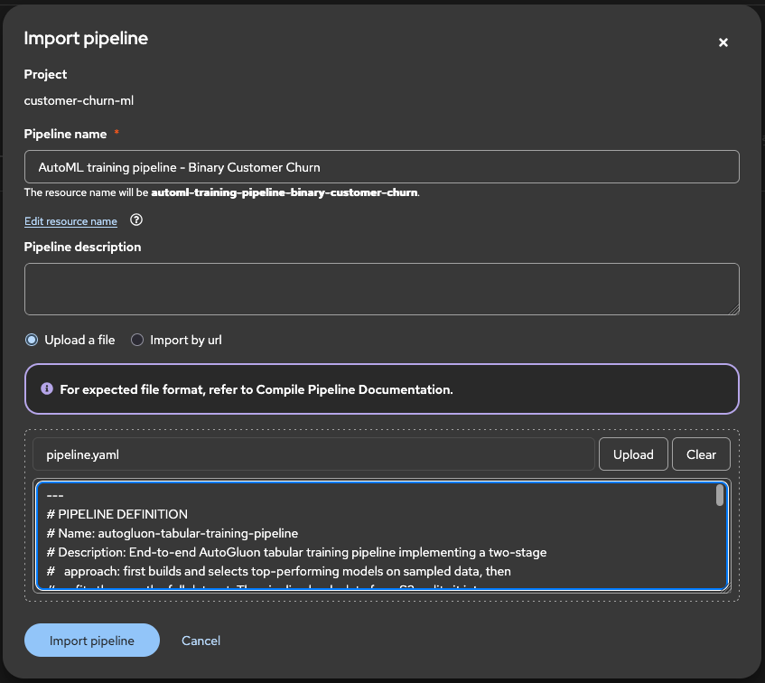

<a id="run-automl-with-the-required-inputs"></a>

## ▶️ Run AutoML with the required inputs

| Step | Action |
|------|--------|
| **①** | From **Pipelines**, create a new pipeline run using **Pipeline definitions → ⋮ → Create run** for the AutoML pipeline you added. |
| **②** | Set the **Name** of the pipeline run and run parameters (see section **What you need to provide** for what each means): **train_data_secret_name** (connection name from **Create the S3 connections** — training data connection), **train_data_bucket_name** (bucket from that same connection), **train_data_file_key** (e.g. `data/WA_FnUseC_TelcoCustomerChurn.csv`), **label_column** `Churn`, **task_type** `binary`, **top_n** `3` (or another positive integer). If the UI asks for an experiment or run name, set them as run metadata. |
| **③** | Ensure the Pipeline Server is configured (see [Configure the Pipeline Server](#configure-the-pipeline-server)) with the results S3 connection, so artifacts are stored in the expected bucket. |
| **④** | Start the run via **Create run** and wait for it to complete. |

**Step ② — Set the pipeline run details**

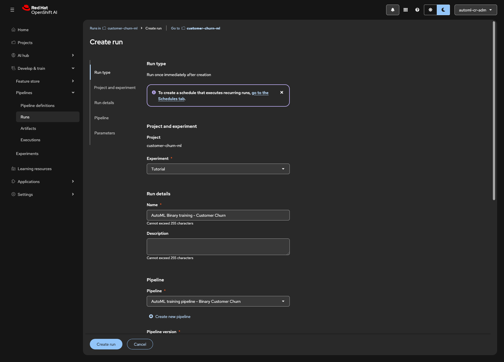
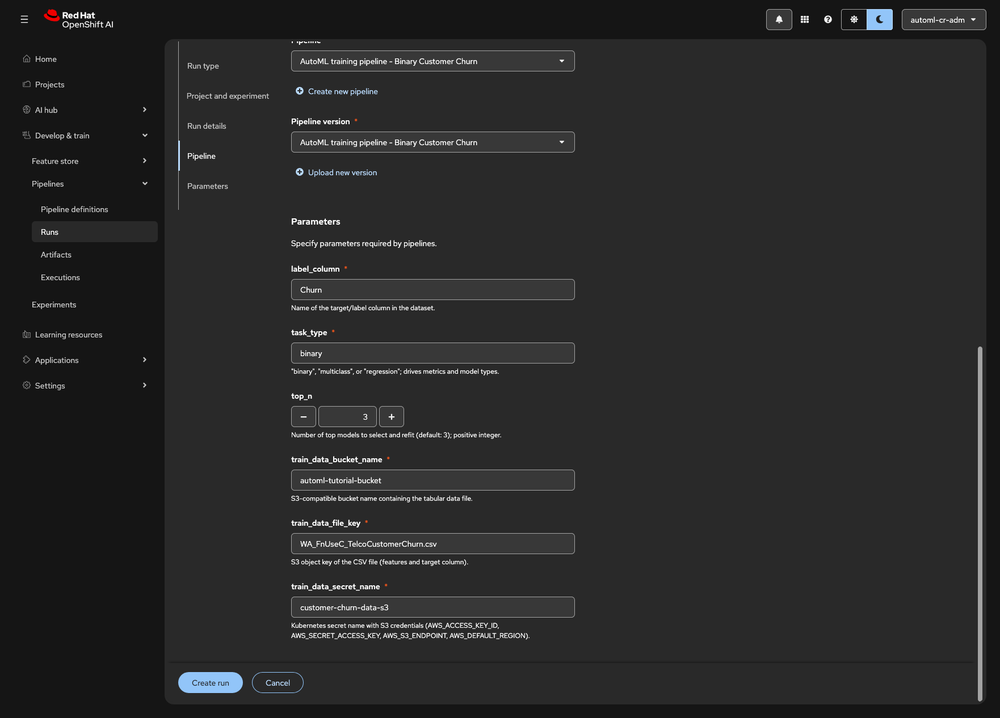

<a id="view-the-leaderboard"></a>

## 📊 View the leaderboard

After the run has completed successfully:

| Step | Action |
|------|--------|
| **①** | Open the run details and go to **Artifacts** (or the artifact store configured for the run). |
| **②** | Locate the **leaderboard** artifact (e.g., an HTML file in the leaderboard-evaluation output). |
| **③** | Download or open the HTML leaderboard to compare the ranked models and their metrics. |

**Step ② — Preview of the leaderboard artifact**

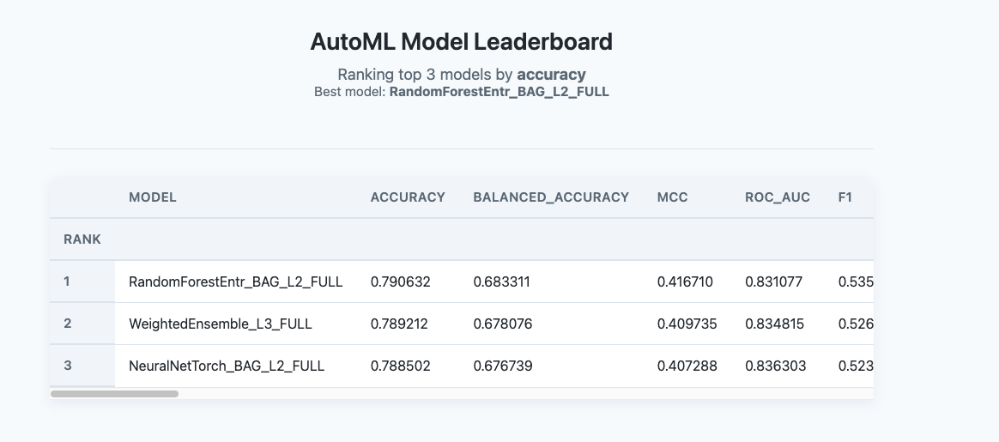

For exact artifact paths and layout, see the pipeline reference below.

<a id="predictor-notebook"></a>

## 📓 Predictor Notebook

The AutoML pipeline generates a **predictor notebook** (e.g. `automl_predictor_notebook.ipynb`) that loads and uses the selected AutoGluon predictor for predictions, evaluation, and exploration. You can download this notebook from the run artifacts, upload it to your workbench, run it, and customize it as needed.

The notebook is saved under `model_artifact.path/model_name_FULL/notebooks`, where `model_artifact.path` is a path like `autogluon-tabular-training-pipeline/<run_id>/autogluon-models-full-refit/<task_id>/model_artifact/` (one such path per refitted model). For example: `...<run_id>/autogluon-models-full-refit/<task_id>/model_artifact/<model_name_FULL>/notebooks/automl_predictor_notebook.ipynb`.

| Step | Action                                                                                                                                                                                                                                                                                                                                                                                                                                                                                                                                                                  |
|------|-------------------------------------------------------------------------------------------------------------------------------------------------------------------------------------------------------------------------------------------------------------------------------------------------------------------------------------------------------------------------------------------------------------------------------------------------------------------------------------------------------------------------------------------------------------------------|
| **①** | Once the AutoML run completes, check the [leaderboard](#view-the-leaderboard) to find the S3 storage path for each model's generated notebook in column "Notebook".                                                                                                                                                                                                                                                                                                                                                                                                     |
| **②** | **Download** the notebook to your local machine from the artifact store (S3) if you have access (e.g. via the workbench S3 connection from **Create workbench with connections attached**). The notebook is under a path like `...<run_id>/autogluon-models-full-refit/<task_id>/model_artifact/<model_name_FULL>/notebooks/automl_predictor_notebook.ipynb` (see the [autogluon_models_full_refit component](https://github.com/LukaszCmielowski/pipelines-components/tree/rhoai_automl/components/training/automl/autogluon_models_full_refit) for the exact layout). |
| **③** | Open your **workbench** (the notebook environment you created in **Create workbench with connections attached**). In JupyterLab, click the **Upload** button (upload icon) in the File Browser sidebar, select the downloaded `.ipynb` file, and upload it. The notebook appears in your workbench file tree.                                                                                                                                                                                                                                                           |
| **④** | Open the notebook and **run** it cell by cell. Ensure the workbench has access to the same S3 bucket (or the path configured in the notebook) so it can load the AutoGluon predictor and any data the notebook expects. If you attached the connections when creating the workbench (see **Create workbench with connections attached**), the bucket is already available.                                                                                                                                                                                              |
| **⑤** | **Customize** if required: edit the model path or artifact location to point to a specific refitted model (e.g. `LightGBM_BAG_L1_FULL`), add cells for extra visualizations or metrics, change sample data, or adapt the notebook for your own workflows. Save the notebook in the workbench when done.                                                                                                                                                                                                                                                                 |

For the notebook path and artifact layout per refitted model, see the [autogluon_models_full_refit component](https://github.com/LukaszCmielowski/pipelines-components/tree/rhoai_automl/components/training/automl/autogluon_models_full_refit). For the overall pipeline, see the [pipeline reference](https://github.com/LukaszCmielowski/pipelines-components/tree/rhoai_automl/pipelines/training/automl/autogluon_tabular_training_pipeline). For creating and importing notebooks in the workbench, see [Creating and importing notebooks](https://docs.redhat.com/en/documentation/red_hat_openshift_ai_self-managed/3.2/html/working_in_your_data_science_ide/working_in_jupyterlab#creating-and-importing-jupyter-notebooks_ide) in the Red Hat OpenShift AI documentation.

**Step ④ — Preview of the predictor notebook in Workbench**

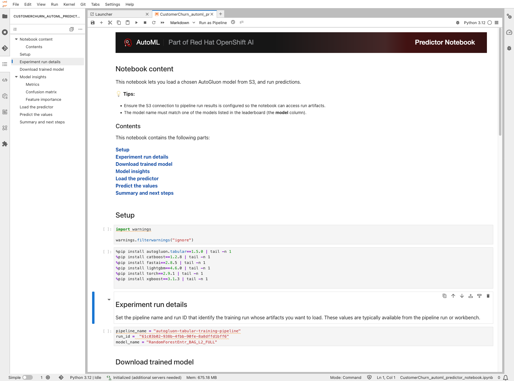

<a id="model-registry"></a>

## 📚 Model Registry

The [autogluon-tabular-training-pipeline](https://github.com/LukaszCmielowski/pipelines-components/blob/rhoai_automl/pipelines/training/automl/autogluon_tabular_training_pipeline/pipeline.py) loads data from S3, splits it, runs **model selection** (top N on sampled data), then **refits** each top model on the full dataset via `autogluon_models_full_refit`. Each refitted model is written as a **model artifact** with a `_FULL` suffix (e.g. `LightGBM_BAG_L1_FULL`, `WeightedEnsemble_L3_FULL`). The pipeline does **not** register models in Model Registry; it only produces the leaderboard and model artifacts in your pipeline artifact store (S3). To version and deploy a chosen model, you register it manually in **Red Hat OpenShift AI Model Registry** as described below.

**Creating a model registry (one-time, typically by an administrator)**

If your cluster does not yet have a model registry, an OpenShift AI administrator must create one and connect it to an external MySQL database.

| Step | Action |
|------|--------|
| **①** | From the OpenShift AI dashboard, go to **Settings** → **Model resources and operations** → **AI registry settings**. |
| **②** | Click **Create model registry**. In the dialog, enter a **Name** (and optionally a **Description**). Optionally edit the **Resource name** (must be lowercase alphanumeric with hyphens, max 253 characters). |
| **③** | In **Connect to external MySQL database**, enter **Host**, **Port**, **Username**, **Password**, and **Database**. Add a CA certificate if the database uses TLS. |
| **④** | Click **Create**. The new model registry appears on the AI registry settings page. |

**Step ② — Create model registry settings**

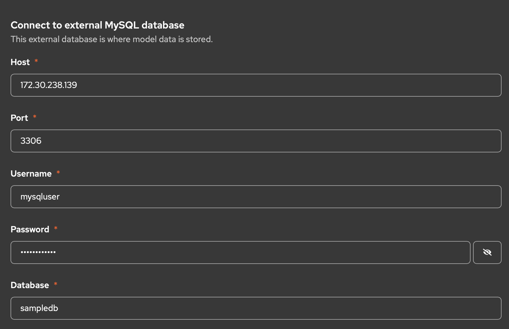

For full details and prerequisites (e.g. MySQL 5.x or 8.x), see [Creating a model registry](https://docs.redhat.com/en/documentation/red_hat_openshift_ai_cloud_service/1/html/managing_model_registries/creating-a-model-registry_managing-model-registries) in the Red Hat OpenShift AI documentation.

**Registering a refitted AutoGluon model from the pipeline run**

The refit stage writes each top-N model to the pipeline workspace/artifact store; the **Path** you give when registering must point to the **root folder of one refitted predictor** (the folder that contains the AutoGluon predictor files for that model, `predictor` folder saved in folder named with the `_FULL` suffix). Use the same S3-compatible bucket and credentials that your Pipeline Server uses for run artifacts. The exact path depends on your run; it is typically under the run’s output directory, per refit task, e.g. under a path like `.../autogluon-models-full-refit/<task_id>/model_artifact/<ModelName>_FULL/predictor`.

| Step | Action                                                                                                                                                                                                                                                                                                                                                                                                                                                                                                                                           |
|------|--------------------------------------------------------------------------------------------------------------------------------------------------------------------------------------------------------------------------------------------------------------------------------------------------------------------------------------------------------------------------------------------------------------------------------------------------------------------------------------------------------------------------------------------------|
| **①** | From the OpenShift AI dashboard, go to **AI Hub** → **Registry** → **Model registry** and select your model registry.                                                                                                                                                                                                                                                                                                                                                                                                                                           |
| **②** | Click **Register model**. In the **Register model** dialog, under **Model location**, select **Object storage** (S3-compatible).                                                                                                                                                                                                                                                                                                                                                                                                                 |
| **③** | Enter the S3 details for your pipeline artifact store: **Endpoint**, **Bucket**, **Region**, and **Path** to the **model root folder** of one refitted predictor (e.g. the folder `predictor` containing the `_FULL` model files for `LightGBM_BAG_L1_FULL/predictor` or `WeightedEnsemble_L3_FULL/predictor` from your run). You can get the path from the run’s **Artifacts** (inspect the refit task output) or from your artifact store layout. Alternatively, click **Autofill from connection** if you have a connection that can access that bucket and path. |
| **④** | Enter **Model name** and optional **Description**. Enter **Version name** and set **Source model format** (e.g. custom or the format your registry uses for AutoGluon).                                                                                                                                                                                                                                                                                                                                                                          |
| **⑤** | Click **Register**. The model appears in the Model registry and can be used for versioning, promotion, and deployment (e.g. via the single-model serving platform).                                                                                                                                                                                                                                                                                                                                                                              |

For the pipeline definition and artifact layout, see the [autogluon_tabular_training_pipeline](https://github.com/LukaszCmielowski/pipelines-components/tree/rhoai_automl/pipelines/training/automl/autogluon_tabular_training_pipeline) (pipeline name: `autogluon-tabular-training-pipeline`). For more on working with model registries, see [Working with model registries](https://docs.redhat.com/en/documentation/red_hat_openshift_ai_self-managed/2.22/html/working_with_model_registries/working-with-model-registries_model-registry).

<a id="prepare-the-servingruntime-for-autogluon-with-kserve"></a>

## ⚙️ Prepare the ServingRuntime for AutoGluon with KServe

This section describes how to prepare the AutoGluon serving image and **Serving Runtime** on the cluster using KServe. Build the serving image directly on the cluster using OpenShift ImageStream and BuildConfig, then create the Serving Runtime so it is available when you deploy a model.

**Flow overview**

| Step | Action |
|------|--------|
| **①** | **Build the image** on the cluster using OpenShift ImageStream and BuildConfig. *(Steps described below.)* |
| **②** | **Prepare ServingRuntime YAML** and **create the Serving Runtime** on the cluster. The image is in the internal registry, so you do not need to add image-pull credentials. After this, the runtime is ready for [Model Deployment](#model-deployment). |

---

### Build image directly on Red Hat OpenShift AI

Use the OpenShift Builds flow to build the image on the cluster, then a Serving Runtime that points to the internal image registry. Use the same project/namespace for the build and for the Serving Runtime (e.g. `automl-project`).

**Create ImageStream**

| Step | Action |
|------|--------|
| **①** | In the OpenShift console, left side: **Builds** → **ImageStreams** → **Create ImageStream**. |
| **②** | Paste the following YAML and click **Create**: |

```yaml
apiVersion: image.openshift.io/v1
kind: ImageStream
metadata:
  name: autogluonkserveimagev1
```

**Create BuildConfig**

| Step | Action |
|------|--------|
| **①** | In the console, left side: **Builds** → **BuildConfigs** → **Create BuildConfig** → **YAML View**. |
| **②** | Paste the following and click **Create**: |

```yaml
apiVersion: build.openshift.io/v1
kind: BuildConfig
metadata:
  name: autogluonkserveimagev1
spec:
  source:
    type: Git
    git:
      uri: https://github.com/LukaszCmielowski/kserve
      ref: dev-autogluon-server-rhoai
    contextDir: python
  strategy:
    type: Docker
    dockerStrategy:
      dockerfilePath: autogluon.Dockerfile
  output:
    to:
      kind: ImageStreamTag
      name: autogluonkserveimagev1:latest
  triggers:
    - type: ConfigChange
```

OpenShift will start a build. Wait for the build to complete (e.g. in **Builds** → **Builds**). The image will be available in the internal registry as `image-registry.openshift-image-registry.svc:5000/<namespace>/autogluonkserveimagev1:latest` (use your project namespace, e.g. `automl-project`).

### Prepare ServingRuntime YAML

Create a YAML file for the KServe Serving Runtime. Set:

- `metadata.namespace` to your project name (e.g. `automl-project`),
- `spec.containers[0].image` to the cluster-built image: `image-registry.openshift-image-registry.svc:5000/<namespace>/autogluonkserveimagev1:latest` (use the same namespace as where you built the image, e.g. `automl-project`).
You can also change:
- `metadata.annotations.openshift.io/display-name` to make name on UI more distinguishable

```yaml
apiVersion: serving.kserve.io/v1alpha1
kind: ServingRuntime
metadata:
  name: kserve-autogluonserver
  namespace: {NAMESPACE}
  annotations:
    openshift.io/display-name: "AutoGluon ServingRuntime for KServe"
spec:
  annotations:
    prometheus.kserve.io/port: "8080"
    prometheus.kserve.io/path: "/metrics"
  supportedModelFormats:
    - name: autogluon
      version: "1"
  protocolVersions:
    - v1
    - v2
  containers:
    - name: kserve-container
      image: {SERVING_IMAGE}
      args:
        - --model_name={{.Name}}
        - --model_dir=/mnt/models
        - --http_port=8080
      securityContext:
        allowPrivilegeEscalation: false
        privileged: false
        runAsNonRoot: true
        capabilities:
          drop:
            - ALL
      resources:
        requests:
          cpu: "1"
          memory: 2Gi
        limits:
          cpu: "1"
          memory: 2Gi
```

Replace `{SERVING_IMAGE}` with the image URL above and `{NAMESPACE}` with your project namespace.

### Create the Serving Runtime on OpenShift

| Step | Action |
|------|--------|
| **①** | Log in to the Red Hat OpenShift AI cluster. |
| **②** | In the left menu: **Settings** → **Model resources and operations** → **Serving runtimes** → **Add serving runtime** → **Upload files**. |
| **③** | Upload the ServingRuntime YAML you prepared (with `image` and `namespace` set for your scenario). |
| **④** | In **Select the API protocol this runtime supports**, choose **REST**. |
| **⑤** | In **Select the model types this runtime supports**, select **Predictive model**. |
| **⑥** | Click **Create**. |

**Step ③-⑤ — REST protocol and Predictive model setup**

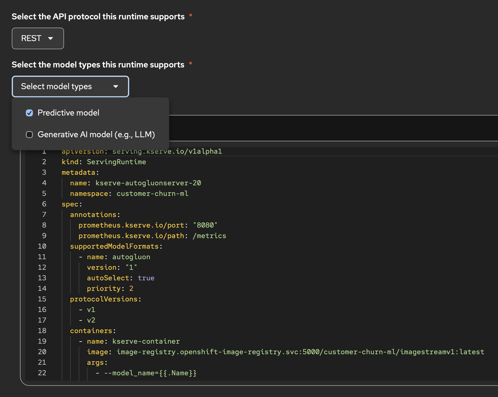

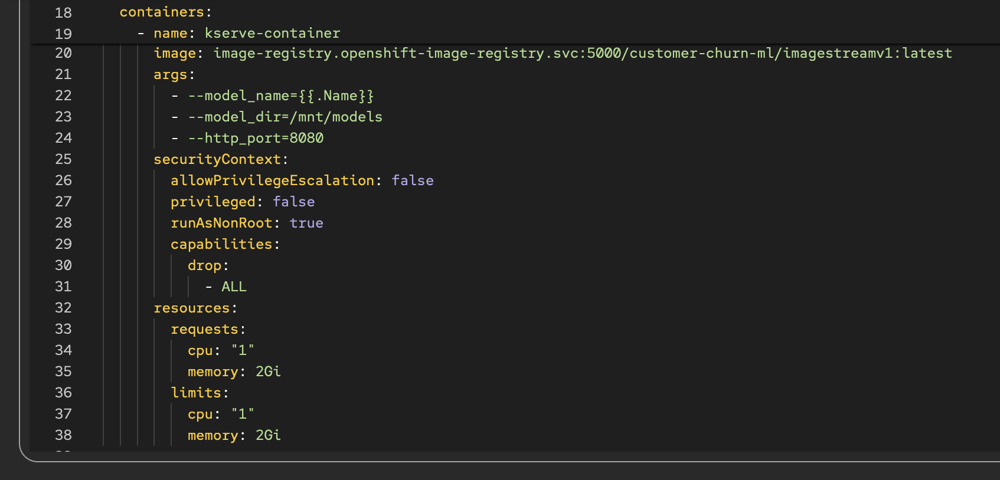

<a id="model-deployment"></a>

## 🚀 Model Deployment

After the [AutoGluon ServingRuntime](#prepare-the-servingruntime-for-autogluon-with-kserve) is created, deploy your AutoGluon model (e.g. from an AutoML run) so it is available for inference. This assumes the model is stored in S3.

| Step | Action |
|------|--------|
| **①** | In the left menu: **Projects** → ***Your Project*** → **Deployments** → **Deploy model**. |
| **②** | Under **Model location**, choose **S3 object storage**. |
| **③** | Create a new connection or use an existing one and fill in the S3 credentials and path to the model. |
| **④** | For **Model type**, choose **Predictive model**, click **Next**. |
| **⑤** | In **Model deployment name**, enter the model name under which the model should be available for inference. Use only lowercase letters, without spaces or special characters. |
| **⑥** | Under **Model framework**, select **autogluon - 1**. |
| **⑦** | Under **Serving runtime**, choose **Select from list…** → **AutoGluon ServingRuntime for KServe**, click **Next**. |
| **⑧** | You can configure **Advanced settings** to control access and reachability - for example, **Require token authentication** for secured access, or **Make model deployment available through an external route**, so you can call the model from outside the cluster (e.g. for scoring from your laptop or another service), click **Next**. |
| **⑨** | Review configuration and click **Deploy model**. |
| **⑩** | After the deployment is running, use the inference endpoint URL from the deployment details. See [Deployment Scoring](#deployment-scoring) for an example request. |

**Steps ②-④ — Model details**

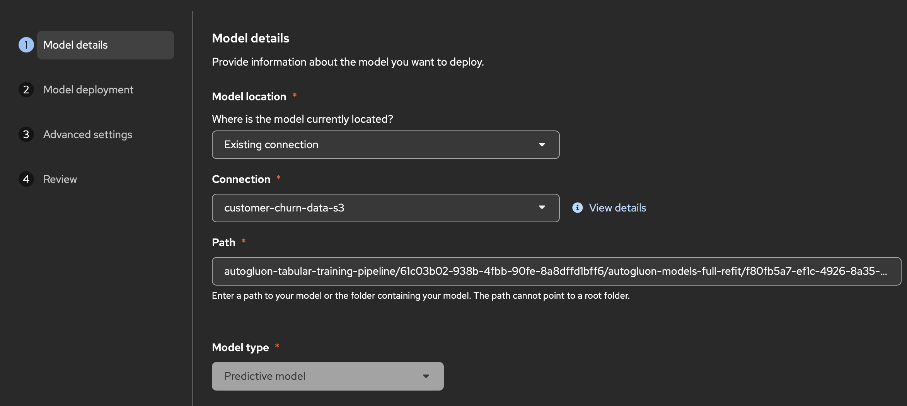

**Steps ⑤-⑦ — Model deployment settings**

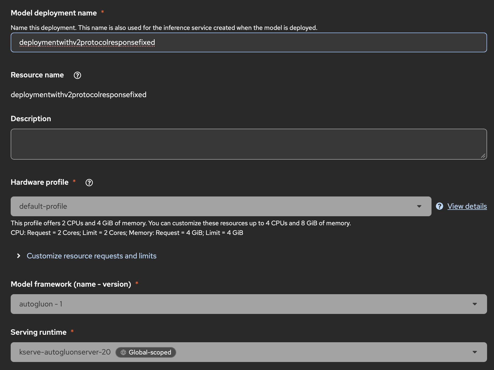

For more on serving and APIs, see [Deploying models on the model serving platform](https://docs.redhat.com/en/documentation/red_hat_openshift_ai_self-managed/3.2/html/deploying_models/deploying_models#deploying-models-on-the-model-serving-platform_rhoai-user).

<a id="deployment-scoring"></a>

## 🎯 Deployment Scoring

To score the deployed model from outside the cluster, use the **External** inference URL (ensure **Make model deployment available through an external route** is enabled in the deployment’s Advanced settings). In the deployment details, under **Inference endpoint**, copy the external URL and use it in your requests.

Example request (replace the placeholders and send a POST to your deployment’s inference (predict) endpoint):

- **`DEPLOYMENT_URL`** — The inference URL from the deployment details (base URL only; the path `/v1/models/<MODEL_NAME>:predict` is appended in the sample).
- **`MODEL_NAME`** — The resource name of the deployment (used in Kubernetes). Find it in **Deployment details** → **Model deployment** → **Resource name**.
- **`YOUR_TOKEN`** — The service account token, only if you enabled **Require token authentication** in Advanced settings. You can retrieve it, by going to **Projects** → ***Your Project*** → **Deployments**, then expanding your deployment and getting value of `Token secret` for available token. If you did not enable authentication, remove the `-H "Authorization: Bearer <YOUR_TOKEN>"` line from the command.

  ```bash
   curl -X POST \
   "<DEPLOYMENT_URL>/v1/models/<MODEL_NAME>:predict" \
   -H "Content-Type: application/json" \
   -H "Authorization: Bearer <YOUR_TOKEN>" \
   -d '{
     "instances": [
       {
         "gender": [1],
         "SeniorCitizen": [0],
         "Partner": [1],
         "Dependents": [0],
         "tenure": [12],
         "PhoneService": [1],
         "MultipleLines": ["No"],
         "InternetService": ["Fiber optic"],
         "OnlineSecurity": ["No"],
         "OnlineBackup": ["Yes"],
         "DeviceProtection": ["No"],
         "TechSupport": ["No"],
         "StreamingTV": ["Yes"],
         "StreamingMovies": ["No"],
         "Contract": ["Month-to-month"],
         "PaperlessBilling": [1],
         "PaymentMethod": ["Electronic check"],
         "MonthlyCharges": [70.35],
         "TotalCharges": [800.40]
       }
     ]
   }'
   ```

   Example response:

  ```json
  {
    "predictions": [
      "No"
    ]
  }
  ```

Reference for more info about v1 protocol: [KServe V1 Protocol](https://kserve.github.io/website/docs/concepts/architecture/data-plane/v1-protocol)
