# AutoML

**AutoML** on Red Hat OpenShift AI automates building and comparing machine learning models for **tabular data**. You can provide a dataset and the target you want to predict; AutoML trains many model types, ranks them, and gives you a leaderboard so you can choose a model and optionally register or deploy it without writing training code. See [Example scenarios](#example-scenarios) for typical use cases and a step-by-step tutorial.

**Status:** [Developer Preview](https://access.redhat.com/support/offerings/devpreview) — This feature is not yet supported with Red Hat production service level agreements (SLAs) and may change. It provides early access for testing and feedback.

---

## Table of contents

- [About AutoML](#about-automl)
  - [What AutoML gives you](#what-automl-gives-you)
  - [What AutoML supports (Developer Preview)](#what-automl-supports-developer-preview)
  - [How it works under the hood](#how-it-works-under-the-hood)
- [What you need to provide](#what-you-need-to-provide)
  - [Required input parameters](#required-input-parameters)
  - [Optional input parameters](#optional-input-parameters)
- [What you get from a run](#what-you-get-from-a-run)
- [Example scenarios](#example-scenarios)
- [Prerequisites](#prerequisites)
- [Running AutoML](#running-automl)
- [Tutorial: Predict the Customer Churn](churn_prediction_tutorial.md)
- [References](#references)

---

## About AutoML

### What AutoML gives you

AutoML takes care of the full workflow so you can focus on your use case:

- **Automated data preprocessing** — Your tabular data (CSV in S3) is loaded, sampled and split into train and test sets.
- **Automated feature engineering and training** — AutoML trains many model types (neural networks, tree-based, linear) using [AutoGluon](https://github.com/autogluon/autogluon)’s ensembling (stacking and bagging), then selects the top performers and refits them on the full dataset for production-ready predictors.
- **Leaderboard** — You get an HTML leaderboard ranking all top models by the right metric for your task (e.g., accuracy or ROC-AUC for classification, R² for regression), so you can compare and pick the best model.
- **Trained models and notebook** — You receive the refitted model artifacts and a generated notebook to explore and use the best predictor. You can then register models in Model Registry or deploy them with KServe if you need serving.

You can run AutoML programmatically via the pipelines API or using AI Pipelines UI; no custom training code is required.

### What AutoML supports (Developer Preview)

In this preview, AutoML supports **classification** (binary and multiclass) and **regression** for tabular data. You can specify the task type and the label column; AutoML handles the rest.

| Area | Support |
|------|--------|
| **Data format** | CSV (tabular) |
| **Data source** | S3-compatible object storage (via RHOAI Connections) |
| **Task types** | Classification (binary, multiclass), regression |
| **Training** | AutoGluon (ensembling: stacking, bagging); automatic model selection and refit on full data |
| **What you get** | Trained model artifacts, HTML leaderboard, generated notebook |
| **How you run it** | AI Pipelines UI, API (programmatic) |

You can register and serve the models AutoML produces using RHOAI Model Registry and KServe separately.

**Not in scope:** Non-tabular data (e.g., images, text), traditional hyperparameter tuning as the primary method, unsupervised learning.

### How it works under the hood

AutoML runs as a pipeline on Red Hat OpenShift AI, powered by AutoGluon and orchestrated by Kubeflow Pipelines. Your data is accessed securely via RHOAI Connections (S3 credentials stored as Kubernetes secrets). Model Registry and KServe are not part of the run; you can use them separately to register and/or serve the models  produced by AutoML. For implementation details and the pipeline source, see [References](#references).

**AutoML (AutoGluon tabular) pipeline** — Kubeflow pipeline steps from the [autogluon tabular training pipeline](https://github.com/LukaszCmielowski/pipelines-components/tree/rhoai_automl/pipelines/training/automl/autogluon_tabular_training_pipeline): load CSV from S3, split train/test, run model selection (top-N on sampled data), refit top-N models on full data, then produce leaderboard and model artifacts.

```mermaid
flowchart LR
    Start([Pipeline Start]) --> DataIngestion["Data Ingestion<br/>Load CSV from S3"]
    DataIngestion --> Preprocess["Preprocessing<br/>Split train / test"]
    Preprocess --> Training["AutoGluon Training<br/>Train & compare models"]
    Training --> SelectTopN["Model Selection<br/>Rank & select top-N"]
    SelectTopN --> Refit["Refit on Full Data<br/>Production-ready predictors"]
    Refit --> Artifacts["Artifacts Storage<br/>Leaderboard, models, notebook"]
    Artifacts --> End([Pipeline Complete])
    style Start fill:#2d8659,color:#fff,stroke-width:2px
    style End fill:#2d8659,color:#fff,stroke-width:2px
    style DataIngestion fill:#4a90d9,color:#fff,stroke-width:2px
    style Preprocess fill:#4a90d9,color:#fff,stroke-width:2px
    style Training fill:#4a90d9,color:#fff,stroke-width:2px
    style SelectTopN fill:#4a90d9,color:#fff,stroke-width:2px
    style Refit fill:#4a90d9,color:#fff,stroke-width:2px
    style Artifacts fill:#4a90d9,color:#fff,stroke-width:2px
```

---

## What you need to provide

To run AutoML, you need to provide where your data is and what to predict.

### Required input parameters

| Parameter | Description |
|-----------|-------------|
| **Data location** | S3 connection (RHOAI Connections), the bucket name, and path (key) of your CSV file. AutoML uses the connection’s Kubernetes secret for credentials. |
| **Label column** | The name of the column you want to predict (target). |
| **Task type** | `binary` or `multiclass` for classification, or `regression` for regression. |

### Optional input parameters

| Parameter | Default | Description |
|-----------|--------|-------------|
| **top_n** | `3` | How many top models to refit on the full dataset (and appear on the leaderboard). |

## What you get from a run

When an AutoML run completes, you get:

- **Leaderboard** — HTML file ranking the top models by the right metric for your task (e.g., accuracy or ROC-AUC for classification, R² for regression). Use it to compare and choose the best model.
- **Trained models** — One artifact per top-N model, refitted on the full dataset and ready to use or deploy.
- **Notebooks** — Generated notebook to load and use the best predictor (predictions, evaluation, etc.).

Artifacts are stored in the artifact store configured for your run (e.g., S3 via your Pipeline Server).

## Example scenarios

AutoML lets you tackle common tabular use cases by providing a CSV file and the column to predict — no training code required. For example: predict which telecom customers will churn, which transactions are risky, or what value a property will sell for.

A typical scenario is **predicting customer churn**: you have a table of customers (contract details, usage, demographics) and a column indicating who left. AutoML trains multiple models to predict that column, then gives you a leaderboard, so you can pick the best predictor and use it to flag at-risk customers or drive retention.

| Scenario | Your data | You predict | Outcome |
|----------|-----------|--------------|---------|
| **Customer churn** | Customer attributes, tenure, charges | Will the customer churn? (Yes/No) | Leaderboard + best model; use it to target retention. |
| **Fraud or risk** | Transaction or account features | Is it fraudulent / high risk? | Ranked models; deploy the best for real-time scoring. |
| **Regression** | Property or product features | Price, demand, or other numeric target | Best regression model and metrics (e.g. R²). |

To try this yourself, follow the [Tutorial: Predict the Customer Churn](#tutorial-predict-the-customer-churn) - step-by-step with the Telco Customer Churn dataset on Red Hat OpenShift AI.

---

## Prerequisites

- Red Hat OpenShift AI (RHOAI) installed and accessible, with Kubeflow Pipelines available (see [References](#references) for version).
- **Project** in RHAOI and **Pipeline Server** configured with object storage for runs and artifacts.
- **S3 connection** (RHOAI Connections) for your training data, so AutoML can read your CSV file.

## Running AutoML

You can run AutoML by creating a pipeline run and providing your data location (connection, bucket, file path), label column, and task type. You can set how many top models to refit (`top_n`; default 3). Then, use the Kubeflow Pipelines API or RHOAI Pipelines UI to submit the run.

When the run finishes, open the run’s artifacts to get the leaderboard, trained models, and notebook. From there, you can pick a model and, if needed, register it in Model Registry and/or deploy it with KServe (see [Deploying models on the single-model serving platform](https://docs.redhat.com/en/documentation/red_hat_openshift_ai_cloud_service/1/html/deploying_models/deploying_models_on_the_single_model_serving_platform)).

---

## Tutorial: Predict the Customer Churn

**Scenario:** You have (or download) the **Telco Customer Churn** dataset: one row per customer, with features like contract type, tenure, charges, and a **Churn** column (Yes/No). The goal is to train a model that predicts **Churn**, so you can identify at-risk customers and use the best model from the leaderboard for retention or deployment.

**Step-by-step guide:** The full tutorial walks you through creating a project, S3 connections for results and training data, a workbench with connections attached, adding the AutoML pipeline and dataset, running AutoML with the right settings, viewing the leaderboard, and optionally registering and deploying the best model. Follow the tutorial here: **[Churn prediction tutorial](churn_prediction_tutorial.md)**.

## References

- [KServe (LukaszCmielowski/kserve)](https://github.com/LukaszCmielowski/kserve) — repository containing the Dockerfile (`python/autogluon.Dockerfile`) and directories (`kserve`, `storage`, `autogluonserver`, `third_party`) required to build the AutoGluon serving image for Model Deployment
- [AutoGluon](https://github.com/autogluon/autogluon) — AutoML engine used for training and ensembling
- [Deploying models on the model serving platform](https://docs.redhat.com/en/documentation/red_hat_openshift_ai_self-managed/3.2/html/deploying_models/deploying_models#deploying-models-on-the-model-serving-platform_rhoai-user) — register and serve models after AutoML
- [AutoGluon tabular training pipeline (pipelines-components, branch rhoai_automl)](https://github.com/LukaszCmielowski/pipelines-components/tree/rhoai_automl/pipelines/training/automl/autogluon_tabular_training_pipeline) — implementation reference (pipeline source, parameters, KFP version)
- [KServe V1 Protocol](https://kserve.github.io/website/docs/concepts/architecture/data-plane/v1-protocol) — request/response format and endpoints for `/v1/models/{model_name}:predict`
