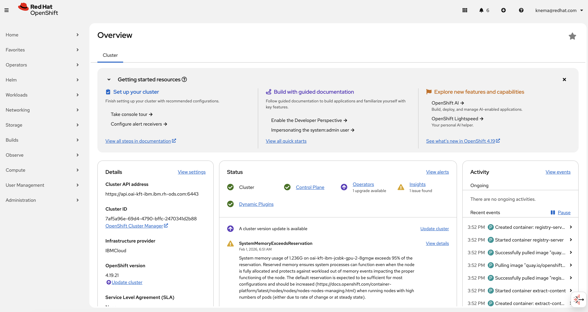
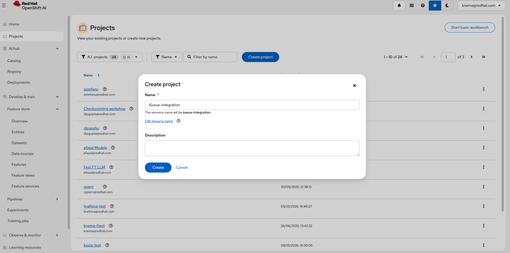
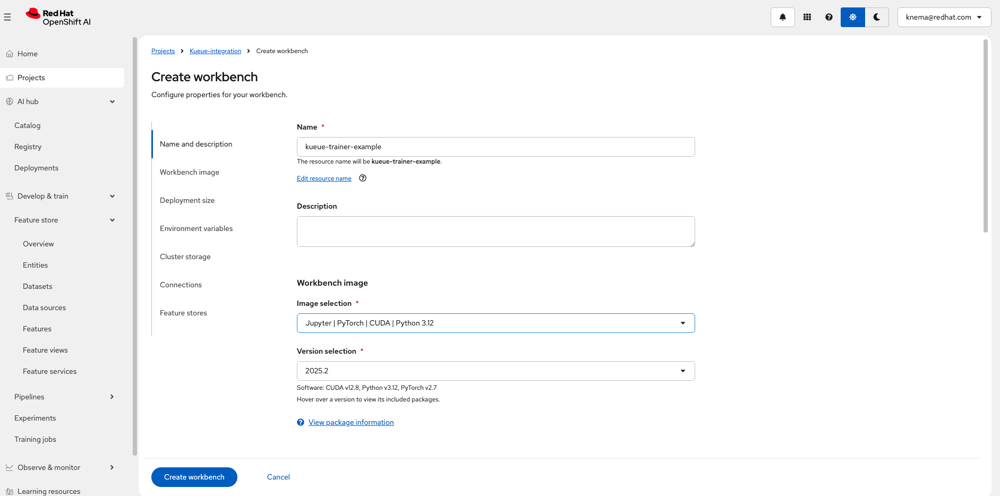
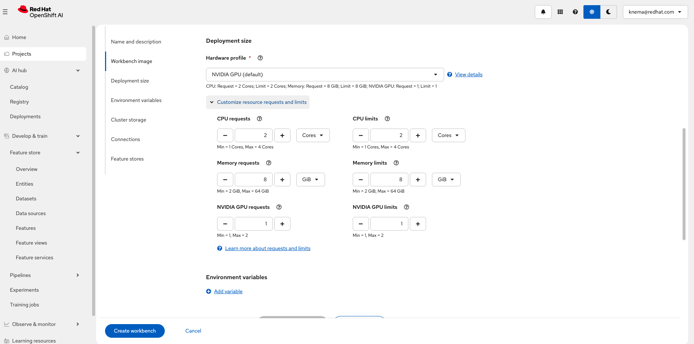
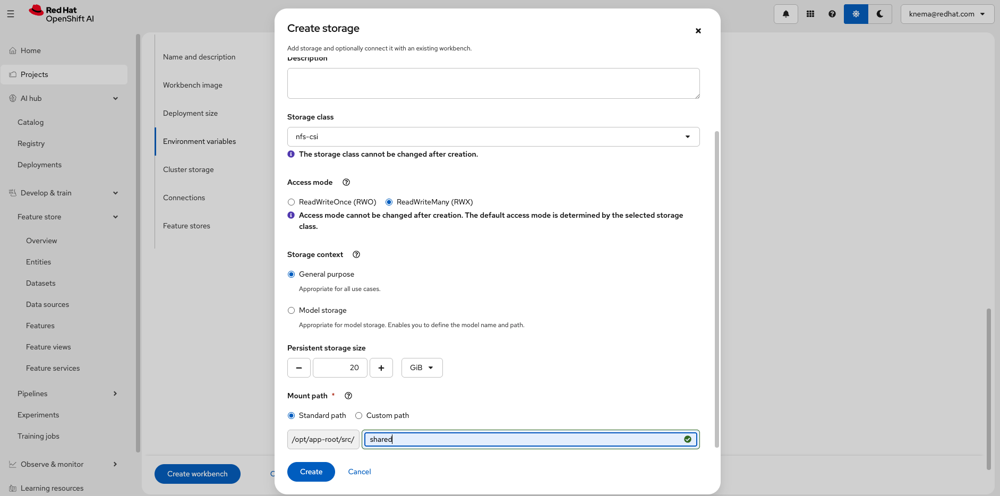
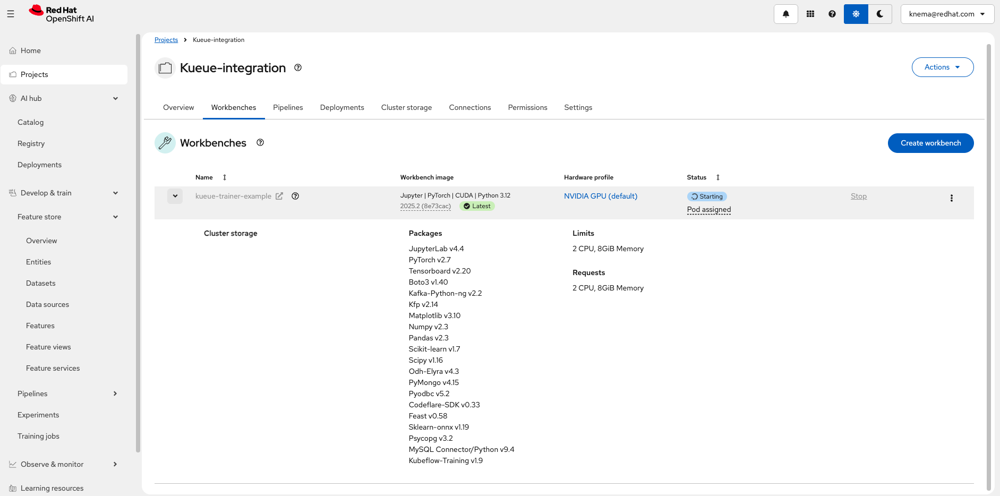
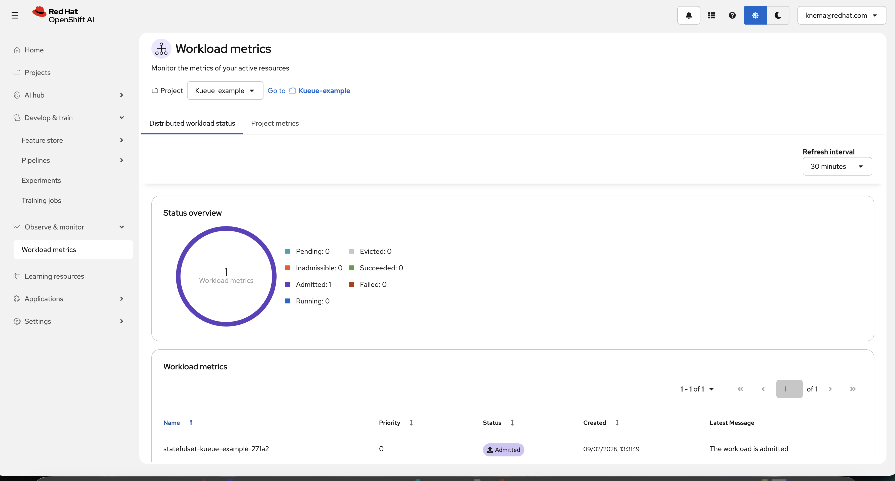

# Kueue-managed TransformersTrainer on Red Hat OpenShift AI

This example demonstrates how to use `TransformersTrainer` with Kueue to run distributed fine-tuning of Hugging Face models on Red Hat OpenShift AI.

## Overview

`TransformersTrainer` is a specialized trainer that extends the Kubeflow `CustomTrainer` with:

* **Automatic progress tracking** — Real-time visibility into training steps, epochs, loss, and ETA
* **Simplified distributed training** — No manual configuration of PyTorch distributed settings
* **Checkpointing (optional)** — Persist checkpoints to shared storage (PVC) using `output_dir="pvc://..."`

This example fine-tunes **Qwen 2.5 1.5B Instruct** on the **Stanford Alpaca** dataset and shows how to route the TrainJob through **Kueue** for advanced scheduling (gang scheduling, queueing, and prioritization).

## Requirements

### OpenShift AI cluster

* Red Hat OpenShift AI (RHOAI) 3.2+ with:
  * `trainer` component enabled
  * `workbenches` component enabled
  * `kueue` component enabled (see Kueue setup below)

### Hardware requirements

#### Training job

| Component | Configuration | Notes |
| --- | --- | --- |
| Training pods | 2 nodes x 1 GPU | Configurable in notebook |
| GPU type | NVIDIA A100/L40/T4 or equivalent | Any CUDA-compatible GPU |
| Memory | 16Gi per pod | Adjust based on model size |

#### Workbench

| Image | GPU | CPU | Memory | Notes |
| --- | --- | --- | --- | --- |
| Minimal Python 3.12 | Optional | 2 cores | 8Gi | GPU recommended for faster testing |

#### Storage

| Purpose | Size | Access mode | Notes |
| --- | --- | --- | --- |
| Shared PVC | 20Gi+ | ReadWriteMany (RWX) | Required for multi-node training and persisting model/data/checkpoints |

## Environment variables

The notebook uses these environment variables for API authentication:

* `OPENSHIFT_API_URL` — your OpenShift API URL
* `NOTEBOOK_USER_TOKEN` — a token for API access

These are often auto-set in OpenShift AI workbenches.

## PVC mount paths (workbench vs training pods)

The notebook uses two different mount conventions:

* **Workbench mount (user-configured)**: when you attach a PVC named (for example) `shared` to the workbench, it is typically mounted at `/opt/app-root/src/<pvc-name>` (e.g. `/opt/app-root/src/shared`).
* **Training pod mount (SDK, fixed)**: when you use `TransformersTrainer(output_dir="pvc://<pvc-name>/<path>")`, the SDK mounts that PVC at `/mnt/kubeflow-checkpoints` inside the training pods.

## Setup

### 1. Access OpenShift AI Dashboard

Access the OpenShift AI dashboard from the top navigation bar menu:



### 2. Create a Data Science Project

Log in, then go to **Data Science Projects** and create a project:



### 3. Create a Workbench

Once the project is created, click on **Create a workbench**:



Configure the workbench with the following settings:

* Choose the appropriate hardware profile based on your needs:



> [!NOTE]
> Adding an accelerator is optional - only needed to test fine-tuned models from within the workbench.

### 4. Create Shared Storage (Required)

Create a storage with RWX access (for example, a PVC named `shared`):



### 5. Start the Workbench

From the "Workbenches" page, click on **Open** when your workbench is ready:



### 6. Clone the Repository

From your workbench, clone this repository:

```bash
git clone https://github.com/red-hat-data-services/red-hat-ai-examples.git
```

Navigate to `examples/trainer/kueue` and open the notebook.

## Configure Kueue for TrainJob support

Kubeflow Trainer requires the **Red Hat build of Kueue (RHBoK)** for resource-aware scheduling and quota management of TrainJobs.

### Fresh installations of RHOAI 3.2

When the Kueue component is enabled in the DataScienceCluster, the RHOAI Operator manages the Kueue CR automatically:

| RHBoK Version | TrainJob Support | Action Required |
| --- | --- | --- |
| 1.2.0 or later | Supported | None - TrainJob framework is added automatically |
| Earlier than 1.2.0 | Not supported | Upgrade RHBoK to 1.2.0 or later |

### Upgrades from previous RHOAI versions

If upgrading from a previous RHOAI version, you must manually add the TrainJob framework to the Kueue CR.

1. Verify RHBoK version:

   ```bash
   oc get csv -n openshift-operators | grep kueue
   ```

2. Verify Kueue controller recognizes TrainJob:

   ```bash
   oc get kueues.kueue.openshift.io cluster -o jsonpath='{.spec.config.integrations.frameworks}'
   ```

   Expected output:

   ```text
   ["Deployment","Pod","PyTorchJob","RayCluster","RayJob","StatefulSet","TrainJob"]
   ```

3. If `TrainJob` is missing, add it:

   ```bash
   oc patch kueues.kueue.openshift.io cluster --type=json -p '[
     {"op": "add", "path": "/spec/config/integrations/frameworks/-", "value": "TrainJob"}
   ]'
   ```

### Enable Kueue for your project namespace

Label your project namespace so Kueue manages TrainJobs automatically:

```bash
oc label namespace <project-namespace> kueue.openshift.io/managed=true
```

When this label is applied, the RHOAI Operator creates a default LocalQueue in the namespace and routes all TrainJobs through Kueue.

## Running the example

The notebook walks you through:

1. **Installing dependencies** — Kubeflow SDK and required packages
2. **Configuring authentication and paths** — API access + PVC mount paths
3. **Staging model and dataset to the PVC** — Download Qwen 2.5 + Alpaca subset from the workbench
4. **Defining the training function** — A `transformers.Trainer` loop that loads inputs from the PVC
5. **Configuring Kueue labels + submitting TransformersTrainer** — Route TrainJobs to Kueue queues
6. **Monitoring progress** — View progress in the OpenShift AI Dashboard (**Training Jobs**)
7. **Cleanup** — Deleting the training job

## Key Features Demonstrated

### Kueue integration

The notebook shows how to attach a Kueue LocalQueue to the TrainJob by adding a label via SDK options:

```python
from kubeflow.trainer.options import Labels

kueue_options = [
    Labels(labels={"kueue.x-k8s.io/queue-name": "<LOCAL_QUEUE_NAME>"}),
]
```

If your namespace uses the default LocalQueue created by the operator, you can use that name directly in the notebook.

Click on a job to view detailed resource allocation and pod status.

### Workload Metrics

To observe and monitor namespace-scoped Kueue-managed workloads, go to **Observe and Monitor** > **Workload Metrics** in the OpenShift AI Dashboard:



This page shows queue utilization, pending workloads, and resource consumption for TrainJobs managed by Kueue.

### Checkpointing (optional)

You can **pause** (suspend) a running job to free up resources. When paused, JIT checkpointing saves the current state:

The notebook demonstrates:

* Configuring PVC storage for checkpoints
* Using the `pvc://` URI scheme
* Suspending and resuming training jobs

## Customization

You can modify the example for your use case:

| Parameter | Default | Description |
| --- | --- | --- |
| `num_nodes` | 2 | Number of training nodes |
| `resources_per_node` | 1 GPU | GPUs per node |
| Model | `Qwen/Qwen2.5-1.5B-Instruct` | Any Hugging Face model |
| Dataset | `tatsu-lab/alpaca` | Any Hugging Face dataset repo |
| `num_train_epochs` | 1 | Training epochs |
| PVC | `shared` | Update `PVC_NAME` in the notebook if you use a different PVC name |

## Troubleshooting

### Job not starting

```bash
# Check TrainJob status
oc get trainjob <job-name> -o yaml

# Check for pending pods
oc get pods -l trainer.kubeflow.org/train-job-name=<job-name>
```

### Progress tracking not working

Verify the logs show initialization:

```bash
oc logs <pod-name> -c node | grep -i "progression"
```

Expected output:

```text
[Kubeflow] Initializing progression tracking
[Kubeflow] Progression tracking enabled
```

### Kueue queue not applied

Verify the TrainJob has the queue label:

```bash
oc get trainjob <job-name> -o jsonpath='{.metadata.labels}'
```

If the label is missing, double-check the `Labels` option in the notebook and the LocalQueue name in your namespace.
